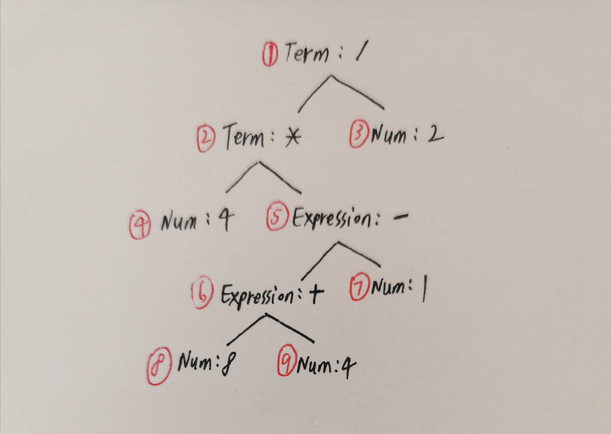

# lab2 实验报告
PB19000260 应宇峰

## 问题1: cpp 与 .ll 的对应
请说明你的 cpp 代码片段和 .ll 的每个 BasicBlock 的对应关系。

1. assign.c

```C++
// CPP
builder->set_insert_point(bb);

auto retAlloca = builder->create_alloca(Int32Type);
auto aAlloca = builder->create_alloca(arrayType);

auto a0GEP = builder->create_gep(aAlloca, {CONST_INT(0), CONST_INT(0)});
builder->create_store(CONST_INT(10), a0GEP);
auto tmp = builder->create_load(a0GEP);
auto tmp2 = builder->create_imul(CONST_INT(2), tmp);
auto a1GEP = builder->create_gep(aAlloca, {CONST_INT(0), CONST_INT(1)});
builder->create_store(tmp2, a1GEP);

builder->create_ret(tmp2);
```
```llvm
; ll
define i32 @main() {
label_entry:
  %op0 = alloca i32
  %op1 = alloca [10 x i32]
  %op2 = getelementptr [10 x i32], [10 x i32]* %op1, i32 0, i32 0
  store i32 10, i32* %op2
  %op3 = load i32, i32* %op2
  %op4 = mul i32 2, %op3
  %op5 = getelementptr [10 x i32], [10 x i32]* %op1, i32 0, i32 1
  store i32 %op4, i32* %op5
  ret i32 %op4
}
```
只有一个基本块，直接对应

2. fun.c

```C++
// CPP
// callee
std::vector<Type *> IntParam(1, Int32Type);
auto calleeType = FunctionType::get(Int32Type, IntParam);
auto calleeFun = Function::create(calleeType, "callee", module);
auto bb = BasicBlock::create(module, "callee", calleeFun);
builder->set_insert_point(bb);

std::vector<Value *> args;  // fetch params
for (auto arg = calleeFun->arg_begin(); arg != calleeFun->arg_end(); arg++) {
    args.push_back(*arg);   // * 号运算符是从迭代器中取出迭代器当前指向的元素
}

auto res = builder->create_imul(CONST_INT(2), args[0]);
builder->create_ret(res);

// main函数
auto mainFun = Function::create(FunctionType::get(Int32Type, {}),
                                "main", module);
bb = BasicBlock::create(module, "entry", mainFun);
// BasicBlock的名字在生成中无所谓,但是可以方便阅读
builder->set_insert_point(bb);

auto call = builder->create_call(calleeFun, {CONST_INT(110)});

builder->create_ret(call);
```
```llvm
; ll
define i32 @callee(i32 %arg0) {
label_entry:
  %op1 = mul i32 2, %arg0
  ret i32 %op1
}
define i32 @main() {
label_entry:
  %op0 = call i32 @callee(i32 110)
  ret i32 %op0
}
```
基本块callee对应汇编中callee函数体，基本块entry对应汇编中main函数体

3. if.c

```C++
// CPP
auto mainFun = Function::create(FunctionType::get(Int32Type, {}), "main", module);
auto bb = BasicBlock::create(module, "entry", mainFun);
builder->set_insert_point(bb);

auto aAlloca = builder->create_alloca(FloatType);
builder->create_store(CONST_FP(5.555), aAlloca);
auto a = builder->create_load(aAlloca);
auto icmp = builder->create_fcmp_gt(a, CONST_FP(1));

auto trueBB = BasicBlock::create(module, "trueBB", mainFun);    // true分支
auto falseBB = BasicBlock::create(module, "falseBB", mainFun);  // false分支

auto br = builder->create_cond_br(icmp, trueBB, falseBB);
builder->set_insert_point(trueBB);
builder->create_ret(CONST_INT(233));

builder->set_insert_point(falseBB);
builder->create_ret(CONST_INT(0));
```
```llvm
; ll
define i32 @main() {
label_entry:
  %op0 = alloca float
  store float 0x40163851e0000000, float* %op0
  %op1 = load float, float* %op0
  %op2 = fcmp ugt float %op1,0x3ff0000000000000
  br i1 %op2, label %label_trueBB, label %label_falseBB
label_trueBB:                                                ; preds = %label_entry
  ret i32 233
label_falseBB:                                                ; preds = %label_entry
  ret i32 0
}
```
基本块entry和汇编中label_entry到label_trueBB段对应，trueBB和false_BB分别和对应标签后的ret语句所在的基本块对应

4. while.c

```C++
// CPP
// main函数
auto mainFun = Function::create(FunctionType::get(Int32Type, {}),
                                "main", module);
auto bb = BasicBlock::create(module, "entry", mainFun);
builder->set_insert_point(bb);

auto aAlloca = builder->create_alloca(Int32Type);
auto iAlloca = builder->create_alloca(Int32Type);
builder->create_store(CONST_INT(10), aAlloca);
builder->create_store(CONST_INT(0), iAlloca);
auto loopBB = BasicBlock::create(module, "loopBB", mainFun);
auto exitBB = BasicBlock::create(module, "exitBB", mainFun);
auto br = builder->create_br(loopBB);

// This is a do-while loop, for more explanation, please check while_hand.ll
builder->set_insert_point(loopBB);
auto i = builder->create_load(iAlloca);
auto i_plus = builder->create_iadd(CONST_INT(1), i);
builder->create_store(i_plus, iAlloca);

auto a = builder->create_load(aAlloca);
auto a_plus = builder->create_iadd(a, i_plus);
builder->create_store(a_plus, aAlloca);

auto cmp = builder->create_icmp_lt(i_plus, CONST_INT(10));

br = builder->create_cond_br(cmp, loopBB, exitBB);

builder->set_insert_point(exitBB);
auto res = builder->create_load(aAlloca);
builder->create_ret(res);
```
```llvm
; ll
define i32 @main() {
label_entry:
  %op0 = alloca i32
  %op1 = alloca i32
  store i32 10, i32* %op0
  store i32 0, i32* %op1
  br label %label_loopBB
label_loopBB:                                                ; preds = %label_entry, %label_loopBB
  %op2 = load i32, i32* %op1
  %op3 = add i32 1, %op2
  store i32 %op3, i32* %op1
  %op4 = load i32, i32* %op0
  %op5 = add i32 %op4, %op3
  store i32 %op5, i32* %op0
  %op6 = icmp slt i32 %op3, 10
  br i1 %op6, label %label_loopBB, label %label_exitBB
label_exitBB:                                                ; preds = %label_loopBB
  %op7 = load i32, i32* %op0
  ret i32 %op7
}
```
基本块entry对应入口部分`label_entry —— label_loopBB`段，基本块loopBB对应循环体`label_loopBB —— label_exitBB`，基本块exitBB对应返回部分`label_exitBB`之后

## 问题2: Visitor Pattern
分析 `calc` 程序在输入为 `4 * (8 + 4 - 1) / 2` 时的行为：
1. 请画出该表达式对应的抽象语法树（使用 `calc_ast.hpp` 中的 `CalcAST*` 类型和在该类型中存储的值来表示），并给节点使用数字编号。
2. 请指出示例代码在用访问者模式遍历该语法树时的遍历顺序。

序列请按如下格式指明（序号为问题 2.1 中的编号）：  
3->2->5->1



遍历顺序  
4->8->9->6->7->5->2->3->1

## 问题3: getelementptr
请给出 `IR.md` 中提到的两种 getelementptr 用法的区别,并稍加解释:
  - `%2 = getelementptr [10 x i32], [10 x i32]* %1, i32 0, i32 %0`
  - `%2 = getelementptr i32, i32* %1, i32 %0`

`getelementptr`的用法和x86_64汇编里的`lea`指令很相似，按照给定的规则对操作数进行加乘来达到计算索引的效果，本质上是连续加乘操作的语法糖（事实上也经常被gcc拿来做代数运算，不过llvm的类型限制不让我这么干:( ）

在第一种情况中，首先获取含10个int的数组的头指针，解引用得到数组本体（`ptr[0] == *ptr`），然后计算目标元素在数组内的偏移（这里类型信息隐式提供了步长），最终得到一个i32；  
第二种情况中，传入的是`i32 *`，对其解引用直接就得到了i32，就是我们期待的返回值，所以没有第二个index了

## 实验难点
描述在实验中遇到的问题、分析和解决方案。

没用过C++，多态、继承啥的不熟所以代码看起来比较折磨

## 实验反馈
吐槽?建议?

吐槽：llvm既然是强类型为啥不能整个自动类型推导。。。每次写变量都得跟着类型好累。。。。。。